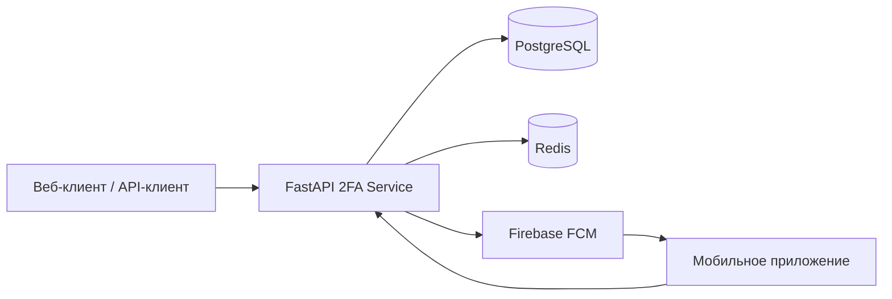
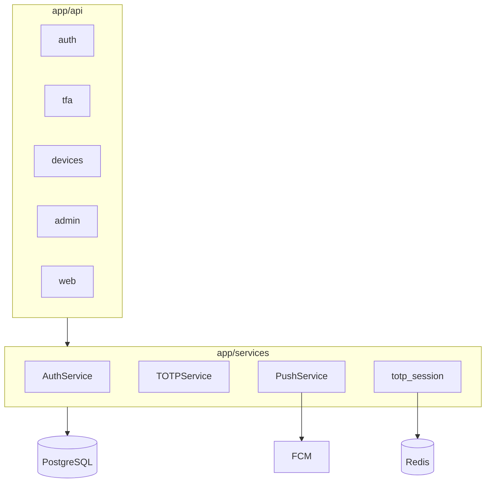
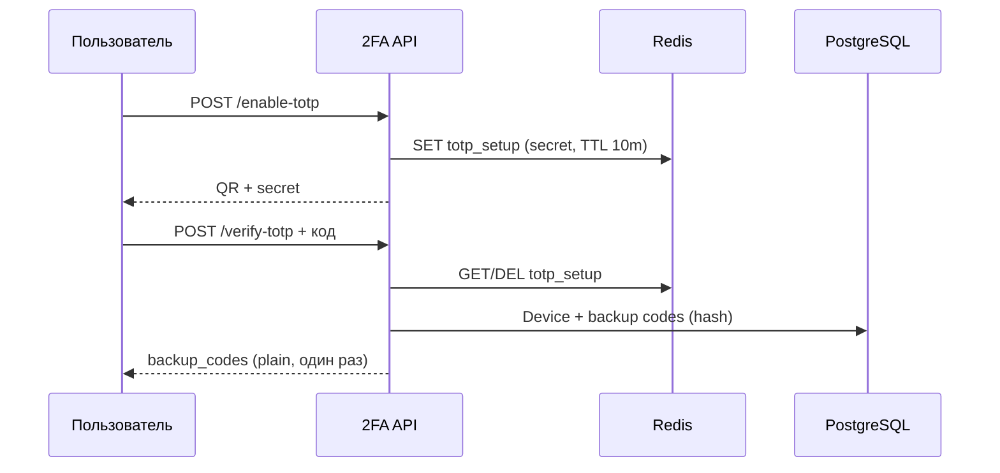

# Архитектура 2FA Service

## Контекст системы

## Компоненты backend

## Сценарий TOTP (RFC 6238)

## Слои данных

| Сущность | Таблица | Назначение |
|----------|---------|------------|
| User | users | Учётная запись, флаг tfa_enabled |
| Device | devices | TOTP / push устройства |
| BackupCode | backup_codes | Резервные коды (хеш Argon2) |

## Безопасность

- Пароли и резервные коды: **Argon2** (passlib).
- JWT: access / refresh / временный токен для шага 2FA.
- SAST: **Bandit** (код), **Safety** (зависимости) — см. `scripts/run_tests.sh` и CI.

## API-документация

Интерактивная спецификация после запуска сервиса:

- Swagger UI: http://localhost:8000/docs
- ReDoc: http://localhost:8000/redoc
